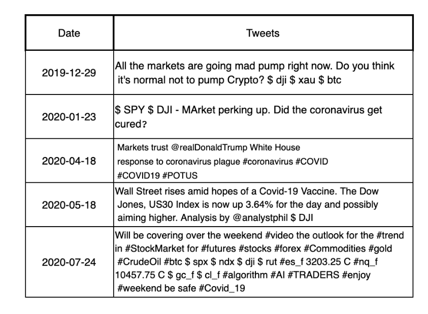
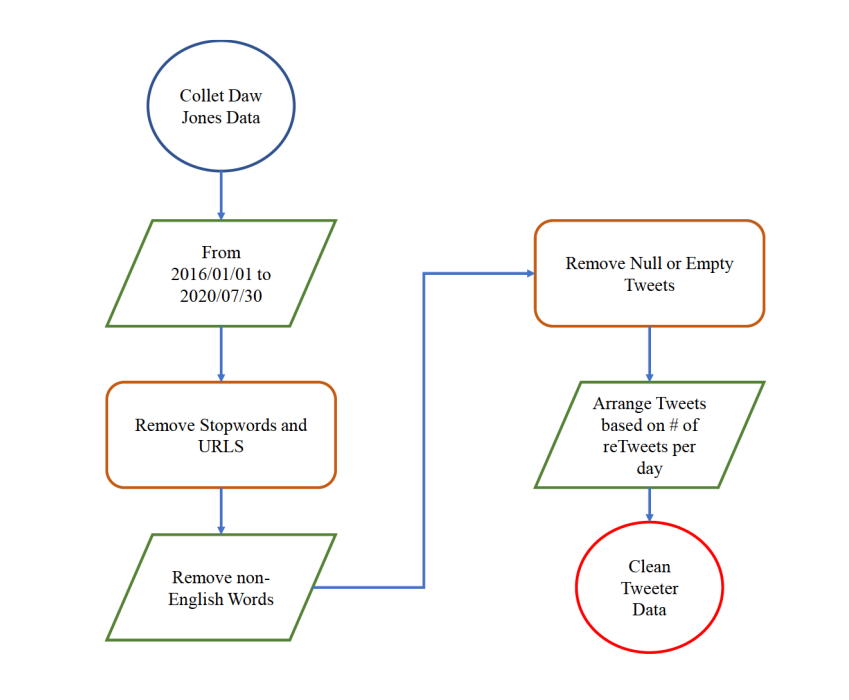

# COVID19_PRIMO

# README #

This README would normally document the content of the Comvest website. 

### What is this repository for? ###

* Quick summary
* Version
* [Learn More about i-sip](http://i-sip.encs.concordia.ca/)

### Materials Covered Here ###
- [About the Project](#About-the-Project)
- [About The Dataset](#About-The-Dataset)
- [COVID19 PRIMO](#COVID19-PRIMO)

## About The Project
A full dataset on the Dow Jones market price and the related tweets from 2016 to 2020. 

A unique and real COVID-19 related PRIce MOvment prediction (COVID19 PRIMO) dataset is constructed to incorporate effects of internet-based and scocial media trends related to COVID-19 on stock market price movements. The main component of the constructed COVID19 PRIMO dataset is based on Twitter messages. It is well known that news and media move stock prices. Nowadays, information reaches out to the public via different news platforms ranging from newspaper, radio and television to social media and internet-based venues. In this area, social media, especially Twitter, is a popular and widely used platform to share personalized opinion on different topics. Twitter is also used extensively by politicians who potentially have high impact on stock price movements. Based on a survey on Statista, from the first quarter of 2017 to 2020, Twitter had 186 million active users worldwide.

## About The Dataset
We have prepared a new dataset for this specific problem, which can facilitate analysis and evaluation of potential impacts of a pandemic on stock market and can prove priceless insights to combat future pandemics. 

The constructed COVID19 PRIMO dataset cconsists of two components, i.e., historical prices and Twitter messages. The first comment, historical data, is obtained from Daw Jones stock market. With the ticker of DJI, Daw Jones is a stock market index that measures the performance of 30 large companies like Apple, Boeing, and Microsoft. Historical stock market prices are obtained from the Yahoo finance [Yahoo Finance](http:https://pypi.org/project/yahoo-finance/).

The dataset presented here is consists of the Dow Jones market price data from 2016 to 2020 and also the related tweets to the Dow Jones which contain #DOW and $DJI (Dow Jones indexes) in this period. The tweets are represented in two format.
- The raw dataset - the tweets without any pre-processing
- The pre-processed data - We deployed some pre-processing approaches on the received strwams of the data, and represents two final csv file containing all the pre-processed tweets.

## COVID19 PRIMO

* Here, we consider the stock movement prediction problem as a binary classification task based on the adjusted closing price.
 
* The focus is on the problem of stock price movement prediction as close observation of market movements can reveal presence of a significant amount of trading targets with minor movement ratios.

* For the news component of the COVID-19 price movement prediction dataset, we focused on Twitter. Figure above shows the block diagram of the appraoch followed to collect and analyze Twitter messages. Web scraping from the Twitter search engine is utilized to build the Twitter dataset. The official API of the Twitter has some limitations that limits the extent of text that can be extracted. Additionally, the official API of the Twitter cuts the tweets at times, which in turn results in items with missing data. We have developed a localized API to address the aformentioned issues. The localized API uses Twitter search engines and directly collects the required dataset from Twitter. We set up our data collection platform based on scraping the twitter website. The twitter web scraping returns the tweet text content with a range of useful attributes, for example, Tweet − ID, Tweet Created at, Retweet, Text, Favorite Count, Hashtag Text, User ID, Followers Count, Friends Count, Statuses Count, User Created at and location. To have more precious information of public tweets, we added a constraint to our implementation to collect tweets retweeted more than once. Many other unnecessary attributes regarding a tweet were also removed from the data gathering session to focus on the essential information such as date, tweet text, and the retweet number. Figure above illustrates an illustrative example of raw tweets collectted by web scraping. 

* A real dataset which is incorporated to evaluate performance of the proposed COVID19-DSMP framework, which illustrates superior performance in comparison to its recently developed counterparts.
 

    
